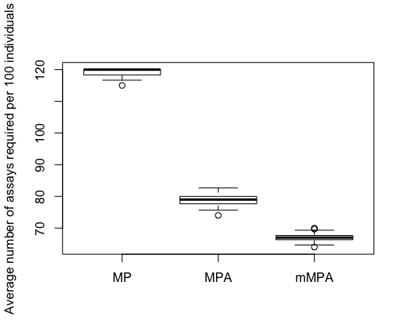

# mMPA
An R package for implementing marker-assisted mini-pooling with algorithm (mMPA)

## Installation 

The latest version of the `mMPA` package is available at GitHub [taotliu/mMPA](http://github.com/taotliu/mMPA). It requires the `devtools` package to be installed in R. If you do not have `devtools` in your R program, use the code  `install.packages("devtools")` to install the `devtools` package first. Then run the following codes to install the `mMPA` package. 

```R
devtools::install_github("taotliu/mMPA")
library(mMPA)
```

## Example 

The following R code example demonstrates the use of the `mMPA` package. 

### Estimate the average number of assays required by mMPA 

Let us assume that blood samples of `n = 300` HIV+ individuals are collected for HIV viral load (VL) testing. We simulate the VL test results using a Gamma (shape = 2.8, scale = 150) distribution, and generate their corresponding risk scores by adding a uniform random noise to the percentile of VL. The resulting VL has a median of `392` and an interquartile range (IQR) from `224` to `565`; the resulting risk score and VL have a Spearman’s correlation of `0.69`. 

```R
 > n = 300
 > set.seed(100)
 > pvl = rgamma(n, shape = 2.8, scale = 150)
 
 > summary(pvl)
   Min. 1st Qu.  Median    Mean 3rd Qu.    Max.
   53      224     392     424     565    1373
 > riskscore = (rank(pvl)/n) * 0.5 + runif(n) * 0.5
 > cor(pvl, riskscore, method = "spearman")
 [1] 0.69
```

We use mMPA to do a pooled VL testing with a pool size of `K = 5`. A total of 60 pools are formed. 

```R
 > # Pool size K is set to 5
 > K = 5
 > # so, the number of pools = 60
 > n.pool  = n/K; n.pool
 [1] 60
``` 
Of course, there are many ways to form pools. Using Monte Carlo simulation, we permute the data `perm_num = 100` time to mimic situations that the individuals came to the clinics in different orders. Thus, different choices of five blood samples are pooled. 

The `mMPA` package includes a function called `pooling_mc(v, s, K, perm_num, method, ...)`, which takes five main arguments as function inputs: Values of test results (`v`), corresponding risk scores (`s`), pool size (`K`), the number of Monte Carlo simulations (`perm_num`), and the method for pooling (which by default use `method = "mMPA"`). The function outputs the total number of VL assays needed for each of the 60 pools from each permutation. 

```R
 > foo = pooling_mc(pvl, riskscore, K, perm_num = 100)
```
 
The output `foo` is a 60x100 matrix, of which each column stores the numbers of VL tests needed by the 60 pools that are formed for each permutation. 

The average number of VL tests needed per pool is then calculated to be `3.35`. 

```R
 > mean(foo)
 [1] 3.35
```

The average number of VL tests needed per individual is then calculated as `0.67`.
```R
> mean(foo)/K
 [1] 0.67
``` 
So the Average number of VL Tests Required per 100 individuals (ATR) is estimated to be 67.  

### Comparison with other pooling algorithms

If we use mini-pooling (MP) for VL testing, we need an average of `1.192` assays for each individual. 

```R
> foo_mp = pooling_mc(pvl, riskscore, perm_num = 100, method = "minipool")
> mean(foo_mp)
[1] 5.96

> mean(foo_mp)/K
[1] 1.192
> 
```

If we use mini-pooling with algorithm (MPA) (c.f. May et al, 2010), we need `0.79` assay per individual on average. 

```R
> foo_mpa = pooling_mc(pvl, riskscore, perm_num = 100, method = "mpa")
> mean(foo_mpa)
[1] 3.94
> mean(foo_mpa)/K
[1] 0.79
```

The ATRs for MP, MPA, and mMPA are 119, 79, and 67, respectively. Graphically, the efficiency of the three pooling algorithms is illustrated by the following graph. 

```R
boxplot(cbind(MP=apply(foo_mp, 2, mean),
              MPA=apply(foo_mpa, 2, mean),
              mMPA=apply(foo, 2, mean))/K*100,
        ylab = "Average number of assays required per 100 individuals")
```


### Calculation of 95% confidence interval using bootstrap

Above we use Monte Carlo simulation (with `100` permutations) to obtain a point estimate of ATR for each of the three pooling methods. It is a "point" estimate because all permutations are carried out on one sample, and not taking into account the sampling variability. In the following, we provide a code example to illustrate how to use the bootstrap method to calculate the 95% confidence intervals for the estimated ATRs. 

```R
### we use 500 bootstrap resamples ###
> n_bt = 500

### For each bootstrap resample, we use Monte Carlo simulation to 
### estimate the ATR for each pooling method. The results are saved 
### in a 500x3 matrix. 
> bt_result = matrix(NA, nrow = n_bt, ncol = 3)

> for(i in 1:n_bt){
+   bt_index = sample(size = n, x = 1:n, replace = T)
+   bt_pvl = pvl[bt_index]
+   bt_riskscore = riskscore[bt_index]
+
+   ### bt_pvl is a bootstrap sample of PVL; the corresponding risk is bt_riskscore
+   bt_result[i, 1] = mean(pooling_mc(bt_pvl, bt_riskscore, perm_num = 100, method = "minipool"))/K*100
+   bt_result[i, 2] = mean(pooling_mc(bt_pvl, bt_riskscore, perm_num = 100, method = "mpa"))/K*100
+   bt_result[i, 3] = mean(pooling_mc(bt_pvl, bt_riskscore, perm_num = 100, method = "mmpa"))/K*100
+ }
```

In the following, we define a function called `ci_foo()` to calculate 2.5% and 97.5% tiles.  
```R
> ci_foo = function(x) quantile(x, probs = c(0.025, 0.975))
> apply(bt_result, 2, ci_foo)
          [,1]      [,2]      [,3]
2.5%  118.2737  75.47583  63.10633
97.5% 119.6833  82.05275  70.74525
```

The 95% confidence intervals are shown in the following table. So for this simulated data set, mMPA requires significantly less VL assays than direct individual testing (IND) and pooled testing using MP and MPA.   

| Method  |  ATR  |     95% CI     |
|---------|:-----:|:--------------:|
| IND     |  100  |       ---      |
| MP      | 119.2 | (118.3, 119.7) |
| MPA     |   79  |    (75, 82)    |
| mMPA    |   67  |    (63, 71)    |


## Contact

Tao Liu, PhD
tliu@stat.brown.edu
